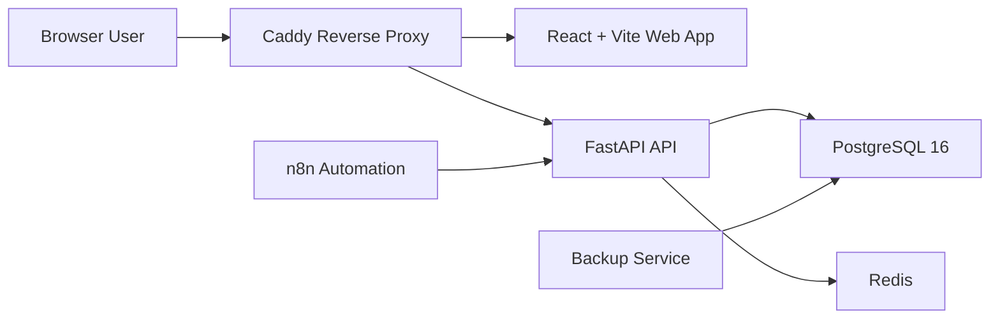
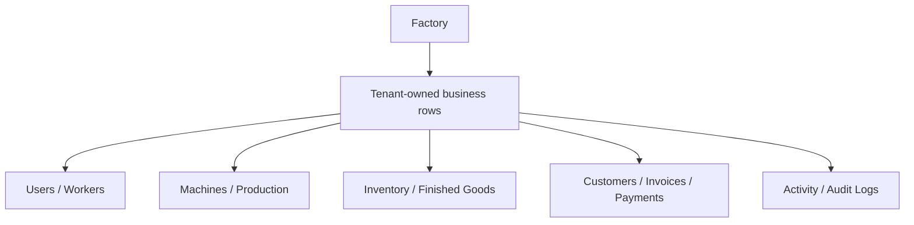
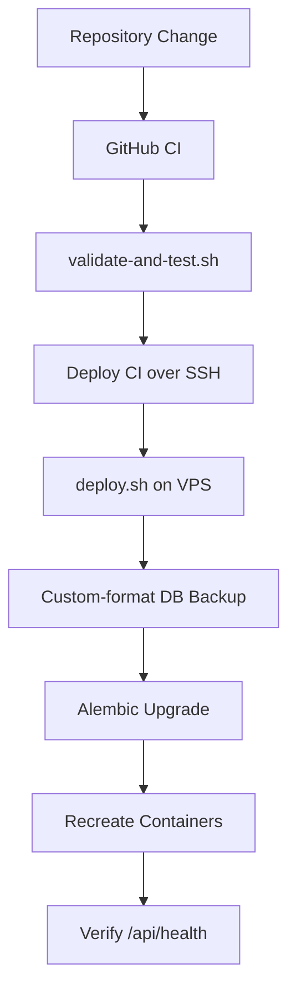
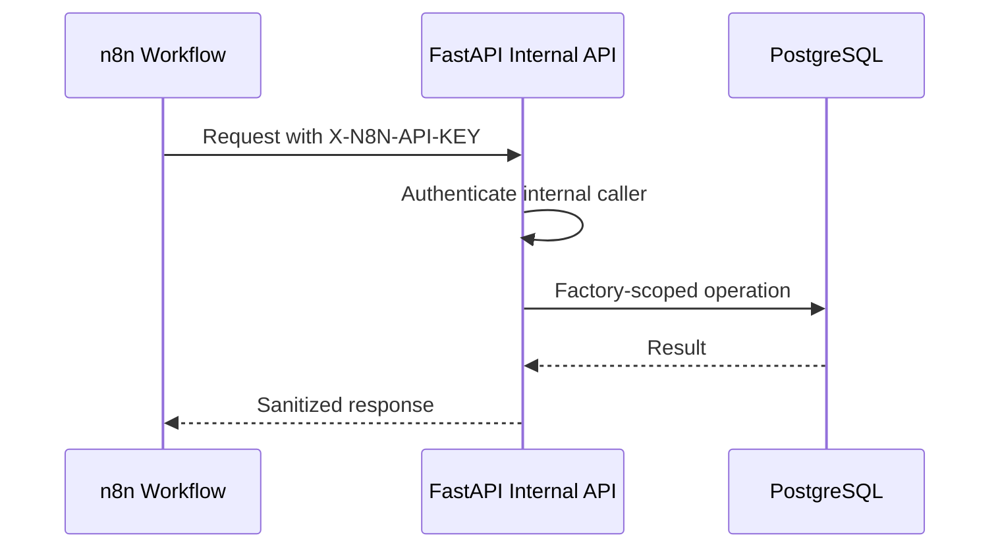
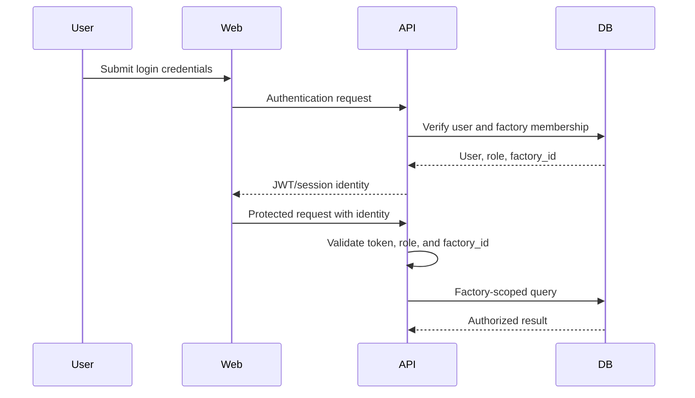
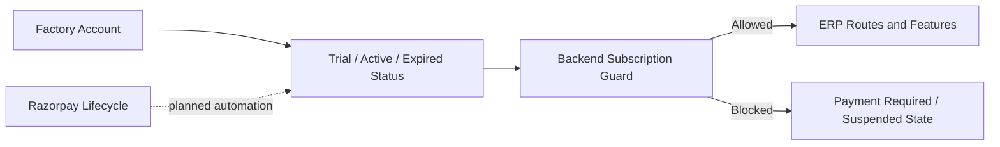
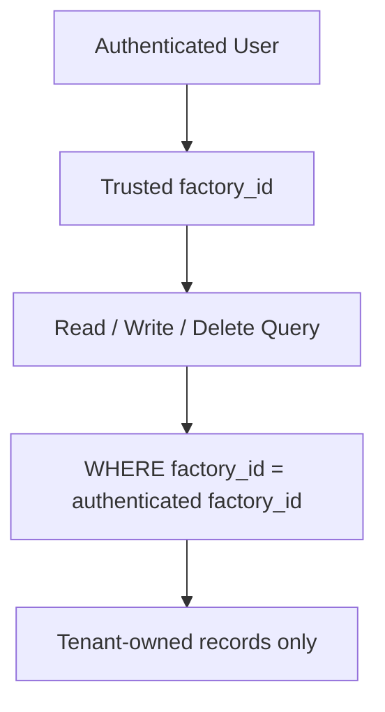

# Munshi AI Architecture

This document summarizes the documented architecture of Munshi AI. `AGENTS.md` remains the authoritative source for engineering and safety rules.

## System Overview

Munshi AI is a multi-tenant manufacturing ERP SaaS, initially focused on paper cup/glass factories and machinery-based production.

Production:

- Web: `https://munshiai.co.in`
- API: `https://munshiai.co.in/api`

## Frontend Architecture

The frontend is a React application built with Vite under `apps/web/`.

Primary structure:

- `src/App.tsx`: application route map.
- `src/components/Layout.tsx`: authenticated shell and sidebar.
- Page modules cover factory operations, staff, attendance, production, inventory, customers, invoices, payments, onboarding, and administration.
- Internal navigation uses router-relative paths.
- `/munshi-control-room` is isolated from normal public and sidebar navigation.

Frontend responsibilities:

- Render authenticated ERP workflows.
- Apply role-aware route and action visibility.
- Call the backend through `/api`.
- Render structured bulk-upload validation results.
- Avoid exposing sensitive values or backend exception details.

Known architectural risk:

- Normal application JWTs are currently stored in browser `localStorage`.
- Migration to safer cookie-based authentication is planned after the pilot.

## Backend Architecture

The backend is a FastAPI application under `apps/api/`.

Core layers:

- FastAPI entrypoint: `apps/api/main.py`
- SQLAlchemy models: `apps/api/models.py`
- Alembic migrations: `apps/api/alembic/versions/`
- Backend tests: `apps/api/tests/`

Major domains:

- Factories and users
- Staff and workers
- Attendance, advances, payroll, and settlement
- Production and machine operations
- Inventory and finished goods
- Customers, invoices, payments, and outstanding bills
- Bulk Excel onboarding
- Subscription lifecycle
- Super Admin controls
- Activity and audit logging

Backend rules:

- Browser-facing unhandled errors must return generic messages.
- Protected reads and writes must enforce both role permissions and factory ownership.
- Super Admin bypasses are restricted to explicit `/api/super-admin/*` routes and must be audited.
- Internal n8n endpoints require `X-N8N-API-KEY`.

## Database Architecture

PostgreSQL 16 is the system of record. SQLAlchemy provides ORM mapping, and Alembic is the only approved production schema-change mechanism.

Database principles:

- Every business record and query is scoped by `factory_id`.
- Schema mutation must not occur during application startup or request handling.
- Production migrations require a timestamped `pg_dump -Fc` backup first.
- Rollback uses backup restoration, not destructive Alembic downgrades.
- Restore drills must use a disposable database.

Current compatibility cleanup:

- `Worker` is canonical.
- `Employee` remains for backward compatibility.
- Attendance and advance-payment records retain legacy `employee_id` while preferring or backfilling `worker_id` for exact same-factory matches.
- Remaining overlaps include `FactoryExpense`/`ExpenseLog`, `FinalProductStock`/`FinishedGoodsStock`, and machine configuration models.

## Deployment Architecture

The production stack runs through Docker Compose and includes:

- Web
- API
- PostgreSQL
- Redis
- Caddy
- n8n
- Backup service

Deployment safeguards:

- CI frontend validation uses `npm run build`.
- `validate-and-test.sh` must pass before deployment.
- `deploy.sh` refuses an uncommitted working tree.
- Production deployment order is backup, migration, container recreation, then health verification.
- Caddy terminates public traffic and proxies application/API requests.
- Production secrets come from environment configuration and must never be committed.

## n8n Architecture

n8n runs as a Docker Compose service for internal workflow automation.

n8n rules:

- Internal API calls require `X-N8N-API-KEY`.
- Workflow operations must preserve `factory_id` isolation.
- API keys and customer data must not appear in logs.
- Centralized monitoring of n8n health remains pending.

## Authentication Flow

The documented authentication model uses JWT-based application sessions and role-based access control.

Security boundaries:

- Normal users cannot access Super Admin APIs.
- Frontend route visibility and backend permissions must remain aligned.
- Authentication must not bypass object-level factory ownership checks.
- JWT cookie migration is planned; current `localStorage` usage is a known risk.

## Subscription Flow

Subscription state controls factory access and plan capabilities.

Current state:

- Subscription checks are part of protected application access.
- The UI must not silently bypass expired or suspended states.
- Robust Razorpay webhook-driven subscription automation remains pending.
- Payment automation is required before broader SaaS scale.

## Factory Tenant Isolation

`factory_id` is the primary tenant boundary.

Mandatory controls:

- Every business row and query is factory-scoped.
- Detail, update, delete, upload, export, invoice, payment, and dashboard routes verify ownership.
- Bulk uploads assign `current_user.factory_id` server-side.
- Spreadsheet-provided tenant fields cannot override authenticated identity.
- Compatibility backfills match records only within the same factory.
- Cross-factory access should behave as not found or forbidden.
- Super Admin cross-tenant operations require explicit routes and audit logs.

Tenant isolation must never be weakened during cleanup, migration, compatibility work, or feature development.
