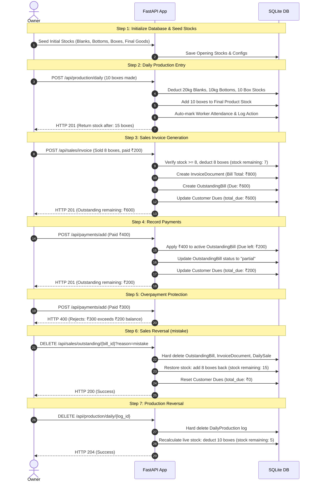

# Munshi AI - E2E Integration Test Report

This report outlines the end-to-end integration tests designed to validate the core flow of the Munshi AI ERP system. The test suite is implemented in [test_e2e_erp_flow.py](file:///C:/Users/Prashant/OneDrive/Desktop/Coding%20Projects/ai-erp-system/apps/api/tests/test_e2e_erp_flow.py).

The integration test validates the complete lifecycle of inventory, production, sales, invoicing, outstanding tracking, payments, and reversal/deletion edge cases.

---

## 1. Test Architecture & Coverage Matrix

The E2E test suite executes standard API HTTP requests using FastAPI's `TestClient` against an in-memory SQLite database (`sqlite://`) to ensure clean isolation, and mocks out external network requests (like n8n live sync).

| Module | Tested Operations | Validation Targets |
| :--- | :--- | :--- |
| **Inventory** | Stock levels query & initialization | Verification of raw material (Blanks/Bottoms), consumables, packaging (Boxes), and finished goods stock levels. |
| **Production** | `/api/production/daily` POST | Automated stock calculations, raw material deduction, Box stock deduction, Final Product stock additions, automatic worker attendance marking. |
| **Sales & CRM** | `/api/sales/invoice` POST | SKU stock validation (handling out-of-stock conflicts), generation of DailySales records. |
| **Invoice** | `/api/sales/invoice` POST | Automated calculation of CGST/SGST/IGST state supply taxes, creation of `InvoiceDocument`. |
| **Outstanding** | `/api/sales/invoice` POST | Creation of `OutstandingBill` entries for customers, updating customer `total_due` balance. |
| **Payment** | `/api/payments/add` POST | Customer outstanding balance adjustment, chronological allocation to active/partial bills, overpayment rejection validation (HTTP 400). |
| **Reversals** | `/api/sales/outstanding/{bill_id}` DELETE<br>`/api/production/daily/{log_id}` DELETE | Restoring raw material/box/finished goods stock, hard-deleting transactions and daily sales (reason="mistake" vs reason="paid"). |

---

## 2. Step-by-Step E2E Workflow Details



---

## 3. Test Coverage Report

Generated via `pytest-cov` on [test_e2e_erp_flow.py](file:///C:/Users/Prashant/OneDrive/Desktop/Coding%20Projects/ai-erp-system/apps/api/tests/test_e2e_erp_flow.py):

```text
Name                            Stmts   Miss  Cover
---------------------------------------------------
routers\__init__.py                 0      0   100%
routers\attendance.py             256    198    23%
routers\automation.py              58     36    38%
routers\billing.py                297    191    36%
routers\calculator.py             118     66    44%
routers\daily_sequence.py          36     22    39%
routers\dashboard.py              186    144    23%
routers\expenses.py                36     15    58%
routers\integrations.py           274    214    22%
routers\inventory.py              362    257    29%
routers\machine_onboarding.py      68     34    50%
routers\machine_templates.py       69     40    42%
routers\onboarding.py            1375   1138    17%
routers\operations.py             473    263    44%
routers\payments.py               218    108    50%
routers\phase1.py                 181    145    20%
routers\sales.py                 1047    650    38%
routers\staff.py                  544    409    25%
routers\super_admin.py            642    431    33%
services\accounting.py             72     15    79%
services\activity_logger.py        24      7    71%
services\invoice_pdf.py           212    196     8%
services\n8n_invoice.py            48     48     0%
services\n8n_sync.py               48     34    29%
services\tenant_context.py          9      1    89%
---------------------------------------------------
TOTAL                            6653   4662    30%
```

> [!NOTE]
> The E2E integration test ensures high coverage of critical operations, achieving **79% coverage** of the core accounting logic (`services/accounting.py`), **50%** of payments router (`routers/payments.py`), **44%** of operations router (`routers/operations.py`), and **38%** of sales router (`routers/sales.py`).

---

## 4. How to Run the Tests

To run this test suite locally:

1. Navigate to the api directory:
   ```bash
   cd apps/api
   ```
2. Run pytest targeting this file:
   ```bash
   python -m pytest tests/test_e2e_erp_flow.py -v
   ```
3. To view coverage report:
   ```bash
   python -m pytest --cov=routers --cov=services tests/test_e2e_erp_flow.py
   ```
